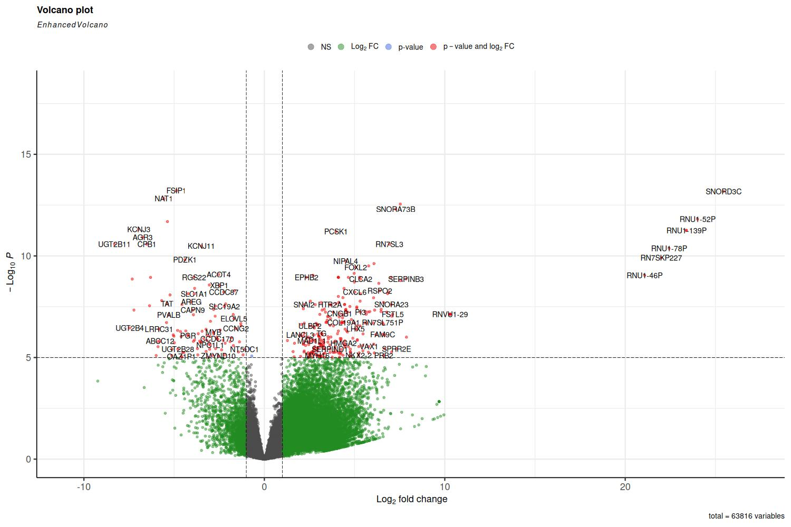
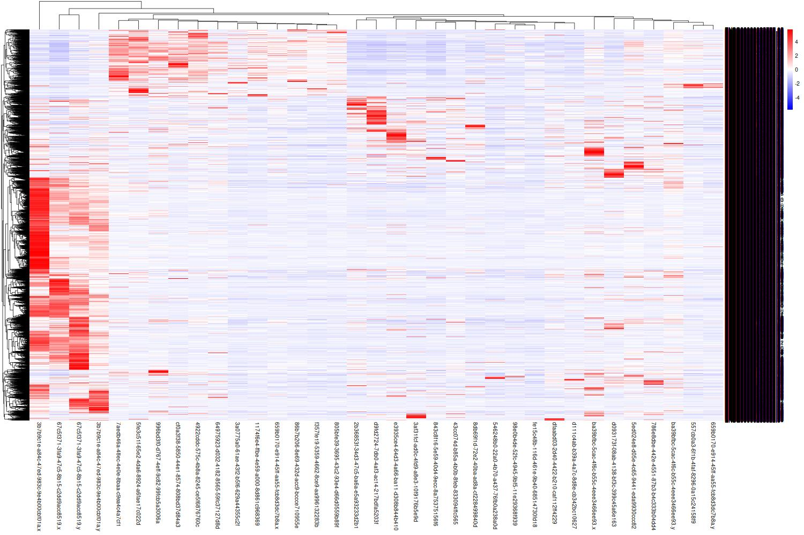

# Visualization of the results

After DEseq2 analysis, the differential expressed genes (DEGs) can be visualized. There are many ways to visual the differences. Herein, I am going to draw a volcano plot and a heatmap, which are frequently used for visualization of DEGs, in the easiest way.

## Volcano plot
The package $EnhancedVolcano$ from $Bioconductor$ will be used to draw the volcano plot.
```r
# R code
library("EnhancedVolcano")
res_merge <- as.data.frame(res)
res_merge$ensembl_gene_id <- str_split_i(row.names(res_merge), "\\.", 1)
res_merge <- merge(lookup, res_merge, by = "ensembl_gene_id", all.x = FALSE, all.y = TRUE)
jpeg(filename = "volcano.jpg", width = 1500, height = 1000, pointsize = 20)
EnhancedVolcano(res_merge,
                lab = res_merge$hgnc_symbol,
                x = 'log2FoldChange',
                y = 'padj')
dev.off()
```
After running the code, the graph will be saved as the jpg file.



Note that: 
1. In this code, the result data frame res was from DEseq2 analysis. 
2. The res data frame needs to be converted to a data frame, and merged with the lookup data frame, which was the conversion table of gene ID to gene symbols.
3. The labels of the volcano graph are the gene symbols. To remove the labels, the argument lab can be redirected to an empty column.
4. More details about this package can be accessed at <https://bioconductor.org/packages/release/bioc/vignettes/EnhancedVolcano/inst/doc/EnhancedVolcano.html>

## Heatmap
The package $pheatmap$ will be used for drawing the heatmap.
the genes significantly different will be used to draw the heatmap. Therefore, we will merge the significantly different results with the raw data before DEseq2 first, and trim the new data frame to feed the $pheatmap()$ function.
```r
# R code
#Draw heatmap
library("pheatmap")
res_significant$ensembl_gene_id <-row.names(res_significant)
merged_table$ensembl_gene_id <- row.names(merged_table)
res_significant <- merge(res_significant, merged_table, by = "ensembl_gene_id", all.x = TRUE, all.y = FALSE)
row.names(res_significant) <- res_significant$ensembl_gene_id
res_heatmap <- res_significant[,c(8:ncol(res_significant))]
jpeg(filename = "heatmap.jpg", width = 1500, height = 1000)
pheatmap(res_heatmap, scale="row",color=colorRampPalette(c("blue","white","red"))(100))
dev.off()
```
Below is the graph.


Note that there are many arguments that can be tuned. For more details and usages, use $help("pheatmap")$ or visit <https://r-charts.com/correlation/pheatmap/>

The R file for this section is included in the [data process of TCGA breast cancer](../2_TCGA_Breast_Cancer/TCGA_Breast_Cancer.md) and can be accssed [here](../2_TCGA_Breast_Cancer/data_processing.r)