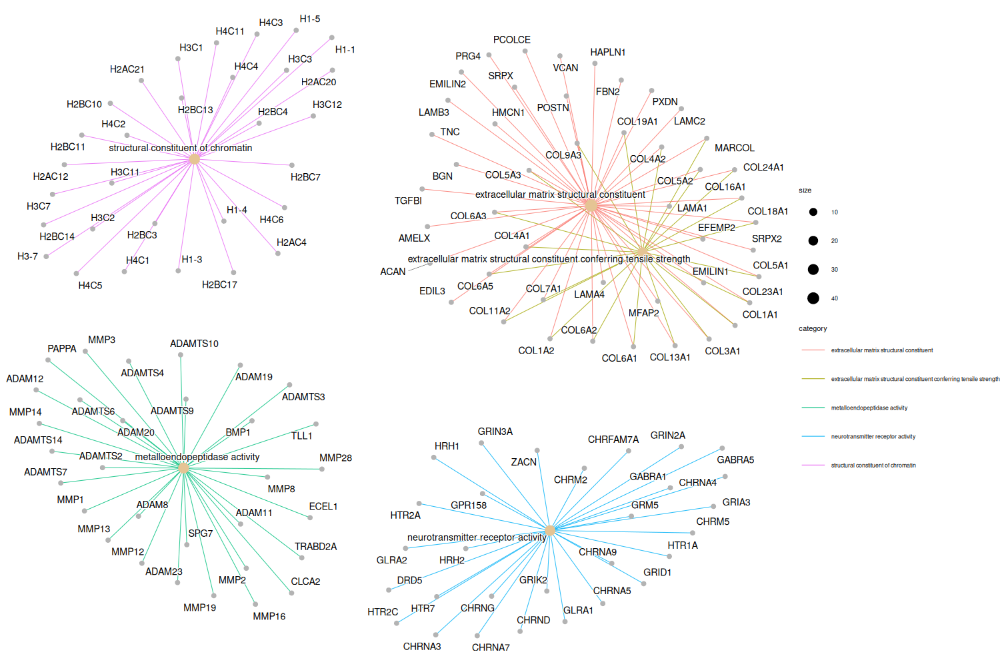
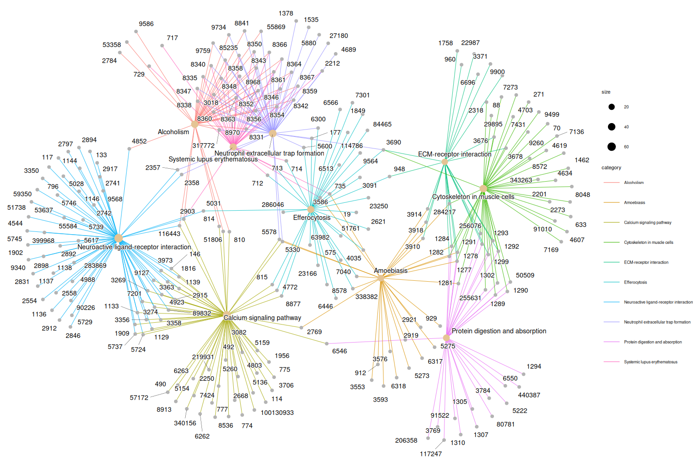
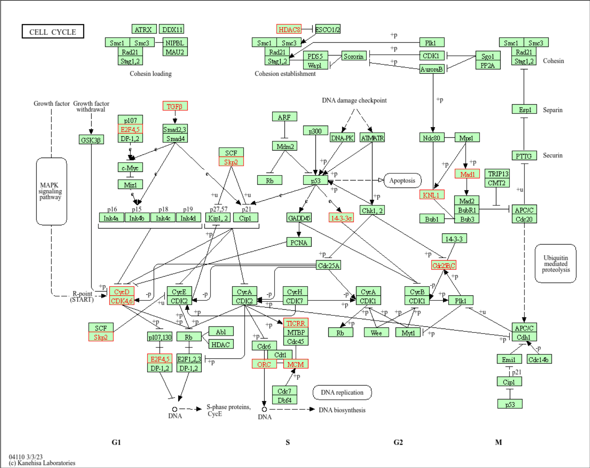
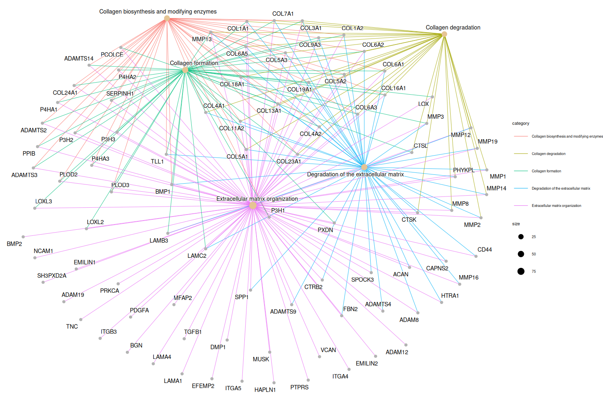

# Gene ontology, KEGG, and reactome analysis
With the significant results, we can perform a series of analyses to further understand underlying mechanisms.

Here, I will use the packages developed by Dr. Yu and colleagues to perform the analyses. Related packages can be installed using BiocManager::install(). They have built a website to describe in detail how to use the packages at <https://yulab-smu.top/biomedical-knowledge-mining-book/>.

## Step 1: select interesting genes
Upregulated genes in metaplastic breast cancer samples will be selected, and only the gene ids will be kept for further analyses.

I will use the [csv file](./significant_results.csv) of significantly differnt genes from the comparison of metastatic and duct breast cancer samples.
```r
#R code
library("dplyr")
library("enrichplot")
library("clusterProfiler")
library("pathview")
library("ReactomePA")

setwd("/Path/To/TCGA_breast")
gene_full <- read.csv("significant_results.csv",header=TRUE)
gene <- gene_full %>%
  filter(log2FoldChange >0) %>%  # select upregulated genes in metaplastic breast cancer
  dplyr::select(entrezgene_id)
  ```

## Step 2: Gene ontology analysis

[Gene ontology (GO)](https://geneontology.org/) annotates genes in three categories: biological process (BP), molecular function (MF), and cellular components (CC). More details about GO can be found on [Wiki(https://en.wikipedia.org/wiki/Gene_Ontology.)

```r
#R code
GO<-enrichGO( gene$entrezgene_id,
              OrgDb = 'org.Hs.eg.db',
              keyType = "ENTREZID",
              ont = "MF",  #one or more in  c("BP", "CC", "MF"), or "ALL"
              pvalueCutoff = 1, # this p value indicates the difference compared to background.
              qvalueCutoff = 1,# This q value is also in comparison with background
              readable = TRUE) # True means converting ids to gene names

# Enrichment plot
png(filename="GO_enrichment.png", width = 1500, height = 1000, pointsize = 30)
cnetplot(GO,circular=FALSE,color.params = list(edge = TRUE))
dev.off()
```
After this step, a PNG file showing the GO enrichment should be generated.


## Step 3: KEGG analysis
[Kyoto Encyclopedia of Genes and Genomes (KEGG)](https://www.genome.jp/kegg/) draws key pathways for high-level functions and utilities of the biological system, such as the cell, the organism and the ecosystem, from molecular-level information, especially large-scale molecular datasets generated by genome sequencing and other high-throughput experimental technologies. Its Wiki is here <https://en.wikipedia.org/wiki/KEGG>.

KEGG analysis is similar to GO analysis.

```r
#R code
KEGG_database <- 'hsa' # this is human database
KEGG<-enrichKEGG(gene$entrezgene_id,
                 organism = KEGG_database,
                 pvalueCutoff = 1,
                 qvalueCutoff = 1
)
png(filename="KEGG_enrichment.png",width = 1500, height = 1000, pointsize = 30)
# Draw the most enriched 10 pathways
cnetplot(KEGG, showCategory = 10, circular=FALSE,color.params = list(edge = TRUE))
dev.off()
```
After running the code, key pathways can be shown in the graph below.



To show sall identified pathway names and associated gene ids, simply run
```r
KEGG@geneSets
```
To visualize the genes in a specific pathway, use the function below.

```r
browseKEGG(KEGG, "hsa04110") # show genes in pathway "hsa04110"
```
The above function will open the browser and show the graph from [kegg.jp](https://www.kegg.jp/kegg-bin/show_pathway?hsa04110/1874/4174/90381/4998/994/55869/6502/57082/1021/7040/894/8379/2810) website with specific genes highlighted.




## Step 4: Reactome analysis
Reactome analysis can be done similarly.
```r
# R code
PA <- enrichPathway(gene=gene$entrezgene_id, pvalueCutoff = 1, readable=TRUE)
png(filename="Reactome_enrichment.png",width = 1500, height = 1000, pointsize = 30)
cnetplot(PA, showCategory = 5, circular=FALSE,colorEdge = TRUE)
dev.off()
```
The graph below shows the reactome enriched.
